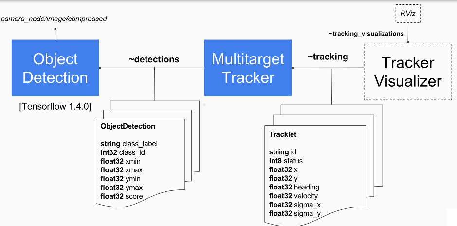

# Implicit Coordination Demo Instructions {#implicit-coord-demo-udem status=beta}

As part of our work in the Implicit Coordination project, we have added three new nodes for the Duckietown infrastructure and their relationship is shown in the figure below.

<!--

-->

<style>
  * {
    padding: 0;
    margin: 0;
  }
  .fit {
    max-width: 100%;
  }
  .center {
    display: block;
    margin: auto;
  }
  .group-photo {
      max-width: 80%;
  }
</style>

<div figure-id="fig:implicit-coord-fsm-udem">
   
   <figcaption>Software architecture of the implicit coordination behavior</figcaption>
</div>


## Object Detection Node

This node source code can be find on the `devel_implicit_coord` branch of `duckietown/Software` repo in the `catkin` workspace at `80-deep-learning/object_detection`

### Prerequisites

For this node, the following libraries have now been add to the Duckietown infrastructure as a dependencies:

- Tensorflow 1.4.0 (GPU/CPU, installed from pip)

### Configuration

The root directoy of the node contains a `default.yaml` configuration file.

```
object_detector:
  inference_graph_path: models/mobilenets_ssd.pb
  score_threshold: 0.2
  denormalize_boundingbox: True
```

Parameters Documentation

```
object_detector:
  inference_graph_path: path to pb file containing the Tensorflow model.
  score_threshold: intersection over union threshold
  denormalize_boundingbox: if the bounding box should be denormalized using image size
```

### Messages

`Detection.msg`
```
string class_label
int32 class_id
float32 xmin
float32 xmax
float32 ymin
float32 ymax
float32 score
```

`ObjectDetectionList.msg`
```
Detection[] detections
```

### Topics

#### Published

`~detections : ObjectDetectionList`

#### Subscribed

`~camera_node/image/compressed : CompressedImage`
