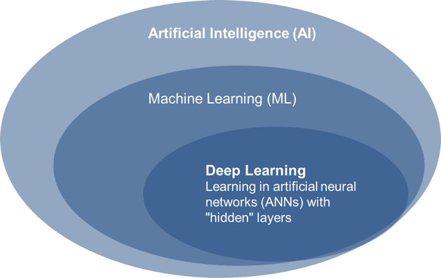
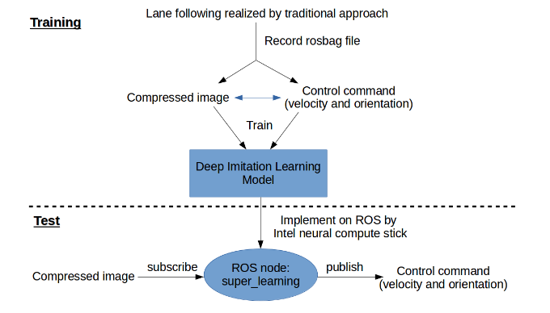

#  Supervised Learning: final report {#supervised-learning-final-report status=draft}

This is the final project report for the group of Supervised Learning at ETH Zurich 2017 Fall Semester. The project motivation, implementation and results are shown here. For inquiries about Convolutional Neural Network training, please contact Shaohui Yang (shyang@ethz.ch), for inquiries about ROS implementation of the project, please contact Tianlu Wang (tiawang@student.ethz.ch).

## The final result {#supervised-learning-final-result}

The final results are shown in the attached video. See the following link. [Recorded video](https://youtu.be/FCP8Ndoxae0) 

## Mission and Scope {#supervised-learning-final-scope}

_Mission:_

To learn policies which match the results from recorded data collected from agents in the real world, so that the vast volumes of the data in the real world can be made useful.

_Scope:_

- Verifying whether Deep Learning can be used successfully in Duckietown;

- Motivated by the concept of ‘Data Processing Inequality’, using supervised and imitation learning to control the Duckiebot end-to-end (input: compressed image, output: control command) with data from a recorded policy;

- Using supervised or unsupervised learning to model specific aspects of the autonomous driving task;
 
- Focus on autonomous lane following by learning based tools. 

### Motivation {#supervised-learning-final-result-motivation}

According to the definition of 'Data Processing Inequality', essential information is prone to be left out along a long processing chain, as the conventional approach for autonomous lane following. To cope with this problem, an end-to-end network is expected to be implemented, which maps input images from camera to vehicles' control command directly.

### Existing solution {#supervised-learning-final-literature}

The similar end-to-end imitation learning neural network has already been implemented by Nvidia for the task of lane following on real roads. The demo details can be seen from the following link. [Nvidia demo](https://youtu.be/-96BEoXJMs0)

In the case of Nvidia's work, researchers did not program any explicit image segmentation, object detection, mapping, path planning or control component into the car. Instead, the vehicle learns on its own to create all necessary internal representations necessary to steer, simply by observing human drivers. The success of learning to drive in complex environments demonstrates new capacities of deep neural network.

### Opportunity {#supervised-learning-final-opportunity}

Though the aim is quite same between Nvidia's work and our project, the specific requirements are different. Moreover, our group is the first one to start projects on supervised learning's application on Duckiebots on Zurich's branch. Therefore, the opportunities can be summarized into following aspects:

- There wasn't previous implementation of supervised learning's application on lane following for Duckiebots;

- The performance of current approach for lane following is not optimal due to the computational limit of Raspberry Pi;

- For Nvidia's implementation, the network's input is the raw images, and the control command is steering angles, gas and brake, which is different from our case in Duckietown, where the control output is only the Bot's orientation; CNN is expected to be adopted in our case to realize the end-to-end control;

Specifically, by implementing the network for lane following, we hope to improve the performance of the conventional approach. This can be assured by two aspects: 

- End-to-end network can have better performance due to 'Data Process Inequality';

- With an extra on-board device Neural Compute Stick for neural network’s implementation, the burden of Raspberry Pi will be released so that more CPU power can be used on higher level path planning, vehicle coordination and city manipulation. 

### Preliminaries (optional) {#supervised-learning-final-preliminaries}

There are three parts of preliminaries that are important to the implementation:

- Understand relations and differences among machine learning, deep learning, imitation learning, supervised learning and unsupervised learning;

- Train an effective Convolutional Neural Network which maps compressed image to orientation of Duckiebots for lane following (the most practical and difficult part);

- Implement a ROS node which subscribes to input images, communicates with Neural Compute Stick for computation, and publishes the computed orientation angle to the car control node. 

Concerning learning related knowledge, the relation between machine learning and deep learning is shown in the following figure. Moreover, machine learning can be categorized into three groups: supervised learning, unsupervised learning and reinforcement learning. Specifically, imitation learning for driving is a supervised learning based tool, that clones behavior. The experts can be humans or optimal/near optimal planners/controllers. In our project, we regard the conventional approach for lane following as optimal  controllers and use it as expert to collect training data.

To know more about Machine Learning and Deep Learning, readers can refer to [ETH Machine Learning Course](https://ml2.inf.ethz.ch/courses/ml/) and [Andrew's Course on Deep Learning](https://www.deeplearning.ai/); to be familiar with CNN, readers can refer to [Stanford University CS231n](http://cs231n.stanford.edu/) for further information; to get familiar with Neural Compute Stick, please refer to [Movidius NCS Information](https://developer.movidius.com/); to know how to implement ROS in our project, please refer to our code directly. Our code are stored in two repositories. One is in the [Duckietown Software](https://github.com/duckietown/Software/tree/devel-super-learning-jan15/catkin_ws/src/80-deep-learning/duckiebot_il_lane_following/src), which contains the code that does all the on-board ROS related computation, while the other is [Duckietown Imitation Learning](https://github.com/syangav/duckietown_imitation_learning). The latter one contains the code to reproduce a CNN model which can be used on Duckiebot. 

## Definition of the problem {#supervised-learning-final-problem-def}

_Final objective:_

We have recorded data of the lane following algorithm exploring the Duckietown by conventional approach. Our goal is to learn a policy which performs as well as, or better than the policy which produced the data. Specifically, a CNN which can predict the orientation for Duckiebots’ heading according to real-time input compressed images effectively is expected to be trained and implemented.

_Assumptions:_

- The policy used to collect the data is reasonably good;

- The errors in imitation learning are sufficiently small to allow a straightforward approach to learn a decent policy;

- Our trained policy can improve the robustness of overall performance due to ‘Data Process Inequality’.

_Evaluation:_

- Effectiveness of the trained CNN;

- Publishing rate of the computed orientation by the neural network, compared with the conventional approach;

- Performance of the overall lane following, compared with the conventional approach.

## Contribution / Added functionality {#supervised-learning-final-contribution}

As mentioned above, our group initiated the learning based approaches for Duckietown. Contributions can be categorized into, successful training of a CNN for lane following and its relevant ROS implementation. The details are demonstrated below.

_Logical Architecture:_

The logical architecture can be seen in the following figure. We developed one node, the trained deep imitation learning model, that maps the compressed images to control command (orientation). All other nodes will remain unchanged.

_Software Architecture:_

There are three main steps for the software part:

- Off-line training with logged data;

- NCS thing works on the laptop;

- Have fun on Duckiebot.

_Model Training:_

We collected data which is composed of around 6000 images and corresponding orientation angles. Then use a CNN model, which has four convolution layers (the last layer is a fully connected one) followed by RELU layer, to train the model. A quite interesting phenomenon is that, the applicable CNN model is only trained based on outer lane data, where the bot turns left and seldom turns right. But the fact is that, the trained model works quite well on inner lane as well, where right turns are most cases. Therefore, inner and outer lane data can be shuffled, then around 2000 training sample pairs will be sufficient.

_ROS Implementation:_

When implementing the ROS node, the different speed of the subscription to images and the computation speed of NCS should be paid attention to. To assure that each of the input image can be processed and imported to the trained network properly, we used a daemon thread to process them. For details, please refer to our code. More proper approaches can also be exploited.

## Formal performance evaluation / Results {#supervised-learning-final-formal}

The overall results of the project can be seen from the demo video: [Recorded video](https://youtu.be/FCP8Ndoxae0). Because we are the first group starting work on supervised learning for Duckietown, it is not possible to compare our results with former groups on the same topic. Therefore, we compared the performance of the lane following based on our neural network and the one realized by conventional approach. 

- Effectiveness: The trained network can perform well on real platforms. Moreover, the time evaluation of the trained model by mvNCprofile is also demonstrated. [Execution Time of CNN](https://github.com/syangav/duckietown_imitation_learning/blob/b5f96d7dc735866aaa4d4317ace223d9013247b7/output.gv.svg)

- Robustness: As shown in the recorded video, the implemented neural network can complete lane following quite well, not only on the Duckiebot which collected data, but on other Duckiebots as well. Moreover, the performance is also desirable on lanes which the trained network that has never seen before. Generally speaking, the trained network is robust to Duckiebots' and lanes' configurations;

- Response: To have a perfect performance on lane following, processors should respond fast enough. By conventional approach, the publishing of car control command is around 2 Hz, with the use of Pi; by using the add-on hardware NCS, the publishing speed of control command can achieve 15 Hz. Therefore, the approach realized by NCS has shown its advantage in our case.

## Future avenues of development {#supervised-learning-final-next-steps}

In our project, the autonomous lane following based on deep learning has already shown its advantages over the conventional approach (refer to last chapter). Therefore, it will be interesting to see the application of learning based tools on other functions of Duckiebots/Duckietown. To be more specific, the following topics can be discussed:

- Learn to stop at intersections: it is important for Duckiebots to stop at intersections for the real application cases. Therefore, the trained network should be extended to complete the relevant task;
- The Saviors: The current approach for detecting duckies on lanes is still based on computer vision technology. Research has shown deep learning's power on object detection. Therefore, it will be reasonable to adopt learning based tools to realize the task of 'The Saviors'.

Moreover, the only thing that limits further development of deep learning in Duckietown is collecting sufficient amount of training data regarding to the topics we would like to focus on. Training data collection can be costly. 

Another thing to be noticed is to merge different neural networks into one. This problem is not shown in our project because we only solved lane following task. However, in the following development, for each individual task, there shall be one corresponding pre-trained specific CNN. For example, the lane following CNN is always running since it's the main task but we do need "stopping at intersection" CNN running as well so that Duckiebots stop as we desired. Shall we have all of those CNN running in the background at the same time, or shall we figure out a way to combine all CNN into one? The former solution is definitely costly but will work for sure, while the second method is computationally optimal but explores a brand new area where different CNN has different structures and weights. Is the combination even possible? 
